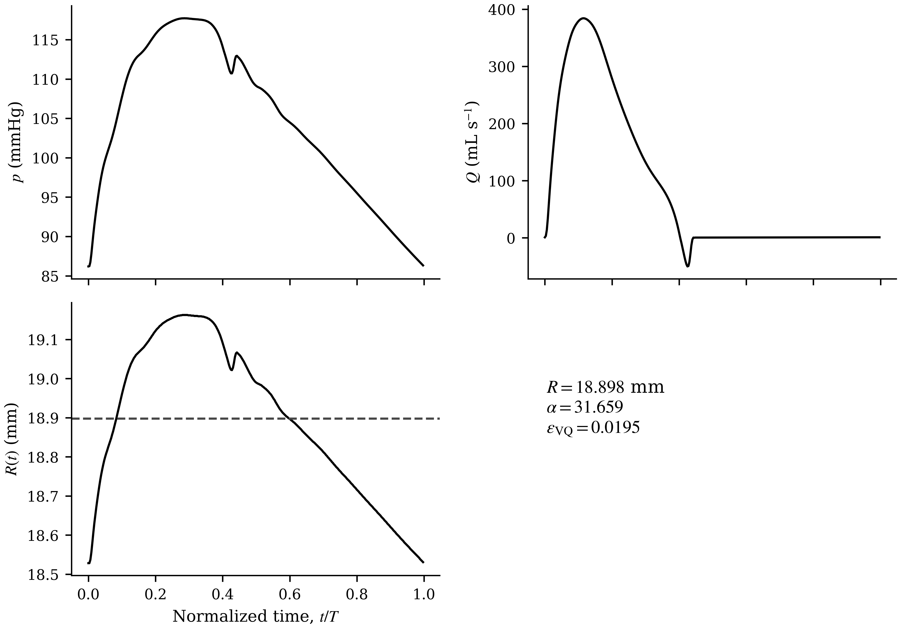

# Nonlinear Arterial Hemodynamics — Code Companion

This repository contains the **eight executable Google Colab companions** to *Nonlinear Arterial Hemodynamics*. There is one notebook for each of Chapters 1–8.

The notebooks reproduce selected mechanics from the book, test limiting cases and numerical consistency, expose parameter dependence, place selected models in virtual-population context through [VascuQuest](https://github.com/KNOWDYN/VascuQuest), and generate reproducible figures and data products.

> **The book is self-contained.** The notebooks are optional computational companions. No definition, derivation, physical argument, or conclusion in the book requires the reader to execute code.

The relationship is deliberately asymmetric:

- **the book defines** the mechanics, nomenclature, assumptions, reductions, and scientific claims;
- **the notebooks reproduce, test, visualize, and extend** those mechanics computationally;
- **VascuQuest supplies reproducible source-data access and population context**, not replacement physics.

---

## Quick start

The released execution contract is **Google Colab + Run all**.

1. Open the notebook for the chapter you are reading.
2. In Colab, choose **Runtime → Run all**.
3. Allow the notebook to install its pinned VascuQuest revision and acquire only the PWDB artifacts it needs.
4. Let the notebook execute sequentially. There are no widgets, hidden branches, or manual subject choices in the released workflows.
5. Inspect the generated <code>figures/</code>, <code>data/</code>, and reproducibility manifest under the notebook-specific <code>/content/nonlinear_arterial_hemodynamics_chXX/</code> directory.

The notebooks pin VascuQuest to commit [<code>8307147d72e7a6f3ea3135895bd6f52927c67439</code>](https://github.com/KNOWDYN/VascuQuest/commit/8307147d72e7a6f3ea3135895bd6f52927c67439) and use the canonical Pulse Wave DataBase (PWDB) Zenodo record [<code>3275625</code>](https://zenodo.org/records/3275625), DOI [<code>10.5281/zenodo.3275625</code>](https://doi.org/10.5281/zenodo.3275625).

> **Local Jupyter execution is not the reference workflow.** The notebooks use Colab paths rooted at <code>/content/</code>. Local execution is possible after adapting those paths, but the reproducibility contract tested for this companion is a clean Colab runtime followed by **Run all**.

---

## The eight notebooks

| Ch. | Book chapter | Notebook | Primary computational responsibility |
|---:|---|---|---|
| 1 | **The Classical Picture of Arterial Hemodynamics** | [GitHub](Notebooks/Chapter_01_VascuQuest_Companion.ipynb) · [Open in Colab](https://colab.research.google.com/github/khalid-saqr/NAH-Code-Companion/blob/main/Notebooks/Chapter_01_VascuQuest_Companion.ipynb) | Poiseuille and pulsatile reference mechanics, dimensionless balances, harmonic representation, and virtual-population context for the classical scales. |
| 2 | **The Mechanical Limits of Wall Shear Stress** | [GitHub](Notebooks/Chapter_02_VascuQuest_Companion.ipynb) · [Open in Colab](https://colab.research.google.com/github/khalid-saqr/NAH-Code-Companion/blob/main/Notebooks/Chapter_02_VascuQuest_Companion.ipynb) | Boundary-versus-volume information, constructive same-WSS counterexamples, velocity–vorticity structure, near-wall integration, and information compression. |
| 3 | **Womersley Flow as the Classical Reference State** | [GitHub](Notebooks/Chapter_03_VascuQuest_Companion.ipynb) · [Open in Colab](https://colab.research.google.com/github/khalid-saqr/NAH-Code-Companion/blob/main/Notebooks/Chapter_03_VascuQuest_Companion.ipynb) | Exact harmonic transfer functions, flow-rate and wall-shear response, asymptotic limits, and multiharmonic rigid-Womersley reconstruction. |
| 4 | **Constitutive Anisotropy and Transverse Dynamics** | [GitHub](Notebooks/Chapter_04_VascuQuest_Companion.ipynb) · [Open in Colab](https://colab.research.google.com/github/khalid-saqr/NAH-Code-Companion/blob/main/Notebooks/Chapter_04_VascuQuest_Companion.ipynb) | Coupled axial–azimuthal dynamics, isotropic recovery, vorticity channels, Lamb-vector observables, and controlled constitutive sensitivity. |
| 5 | **Geometry-Parameterized Spectral Dynamics** | [GitHub](Notebooks/Chapter_05_VascuQuest_Companion.ipynb) · [Open in Colab](https://colab.research.google.com/github/khalid-saqr/NAH-Code-Companion/blob/main/Notebooks/Chapter_05_VascuQuest_Companion.ipynb) | Fourier pseudospectral evolution, spectral redistribution, energy diagnostics, mechanism-off tests, and separation of resolved geometry from reduced coefficient parameterization. |
| 6 | **Wall Compliance and Mean Transport** | [GitHub](Notebooks/Chapter_06_VascuQuest_Companion.ipynb) · [Open in Colab](https://colab.research.google.com/github/khalid-saqr/NAH-Code-Companion/blob/main/Notebooks/Chapter_06_VascuQuest_Companion.ipynb) | Finite-$k$ compliant response, second-order streaming, moving-interface traction, limiting-case recovery, and wall-motion/pressure–area context. |
| 7 | **Nonlinear Arterial Hemodynamics** | [GitHub](Notebooks/Chapter_07_VascuQuest_Companion.ipynb) · [Open in Colab](https://colab.research.google.com/github/khalid-saqr/NAH-Code-Companion/blob/main/Notebooks/Chapter_07_VascuQuest_Companion.ipynb) | Common quadratic convolution examined through separate constitutive, geometry, and compliance branches without constructing an additive multiphysics model. |
| 8 | **Computing the Theory** | [GitHub](Notebooks/Chapter_08_VascuQuest_Companion.ipynb) · [Open in Colab](https://colab.research.google.com/github/khalid-saqr/NAH-Code-Companion/blob/main/Notebooks/Chapter_08_VascuQuest_Companion.ipynb) | Numerical representation, transforms, Bessel evaluation, radial solvers, pseudospectral evolution, finite differences, quadrature, convergence, and provenance. |

A convenience bundle of the eight notebooks is also available at [<code>Notebooks/Notebooks.zip</code>](Notebooks/Notebooks.zip).

---

## Scientific conventions shared by all notebooks

The notebooks use the **book nomenclature**, not database-native shorthand, for reader-facing mechanics.

### Pressure-gradient sign convention

The axial pressure-gradient forcing is

$$
G=-\frac{\partial p}{\partial z},
$$

so positive $G$ drives positive axial flow.

### Radial coordinate and fluid properties

The normalized radius is

$$
x=\frac{r}{R},
$$

with $R$ reserved for vessel radius. Unless a chapter explicitly nondimensionalizes a calculation, the common blood properties used by the notebooks are

$$
\rho=1060\ \mathrm{kg\,m^{-3}},
\qquad
\mu=3.5\times10^{-3}\ \mathrm{Pa\,s},
\qquad
\nu=\frac{\mu}{\rho}.
$$

### Womersley scales

For fundamental angular frequency $\Omega$,

$$
\alpha=R\sqrt{\frac{\Omega}{\nu}},
$$

and harmonic $m$ has

$$
\Omega_m=m\Omega,
\qquad
\alpha_m=\sqrt{m}\,\alpha.
$$

The corresponding viscous penetration ratio is

$$
\frac{\delta_W}{R}=\frac{\sqrt{2}}{\alpha}.
$$

### Temporal and spatial spectral indices are different objects

The temporal harmonic index $m$ and the Chapter 5 spatial reduced wavenumber $\kappa$ belong to different transforms and must not be identified. The dimensional traveling-wave wavenumber used later is $k$.

Chapter 5 uses

$$
\zeta=\frac{z}{L_0},
\qquad
s=\frac{t}{T_0},
$$

and $\kappa$ is conjugate to $\zeta$.

### Reserved symbols

- $R$: vessel radius.
- $R_c$: centerline curvature radius.
- $\mathcal R_{\mathrm{spec}}$: spectral-broadening diagnostic; it is **not** vessel radius and **not** a total-energy growth measure.
- $\tau_w$: wall shear stress; $\widehat\tau_w$: harmonic wall-shear amplitude.
- $Q$: volumetric flow rate.

---

## VascuQuest and PWDB: what enters the notebooks

[VascuQuest](https://github.com/KNOWDYN/VascuQuest) is the data/provenance layer used by these companions. It provides reproducible access to supported PWDB quantities and geometry while preserving evidence provenance.

The notebooks distinguish among:

- **source quantities** read from supported PWDB artifacts;
- **reconstructed quantities**, such as volumetric flow obtained from aligned velocity and area as $Q=UA$;
- **derived quantities** computed from the equations of the book;
- **modelled quantities** produced by an explicit reduced model or branch-specific projection.

This distinction matters. A PWDB observation is not automatically a theorem of the book, and a reduced-model projection is not a source measurement.

PWDB <code>VirtualSubject</code> entries are virtual haemodynamic simulation instances, not patients. Population and age-group plots in these notebooks are therefore **virtual-population context**, not in-vivo epidemiological laws.

The notebook-facing physiological inputs include combinations of radius, heart rate, pressure, flow velocity, luminal area and source-supported geometry, depending on chapter. VascuQuest does **not** provide a native wall-shear-stress field for these notebooks; when a notebook constructs a reference WSS projection, it is identified as a model-derived quantity rather than PWDB-native WSS.

---

## A disciplined way to read the notebooks

Each notebook follows the same scientific spine:

1. **Chapter question** — the physical question owned by that chapter.
2. **Book mechanics used here** — equations and assumptions reproduced from the text.
3. **VascuQuest representation** — how source data are mapped into book variables.
4. **Deterministic reconstruction** — reference mechanics and benchmark quantities.
5. **VascuQuest exploration** — parameter or population context where scientifically meaningful.
6. **Mechanism-focused results** — the quantities that answer the chapter question.
7. **What the reader should learn** — the intended physical interpretation.
8. **Chapter-enrichment candidates** — figures/results that may be useful beyond the notebook.
9. **Reproducibility record** — generated artifacts, provenance, and execution state.

Not every exploratory notebook figure belongs in the printed book. The book promotes only figures that add nonredundant physical understanding; convergence plots, source-mapping diagnostics, sensitivity sweeps, and population context may remain notebook-only.

---

# Notebook guide

## Chapter 1 — The Classical Picture of Arterial Hemodynamics

**Question:** What does the classical Poiseuille–Womersley–WSS description resolve, and where does that information reside?

[Open notebook on GitHub](Notebooks/Chapter_01_VascuQuest_Companion.ipynb) · [Open in Colab](https://colab.research.google.com/github/khalid-saqr/NAH-Code-Companion/blob/main/Notebooks/Chapter_01_VascuQuest_Companion.ipynb)

The notebook reconstructs the steady and pulsatile reference mechanics and then uses VascuQuest to place the classical scales in virtual-population context.

Key ideas to follow:

- Poiseuille flow is a **field solution**, not merely a resistance formula.
- Wall shear stress is an exact boundary traction within the reference model, but it is still a boundary quantity derived from the resolved field.
- Reynolds number and Womersley number organize different balances.
- A periodic waveform contains multiple temporal harmonics, and harmonic $m$ experiences $\alpha_m=\sqrt m\,\alpha$.
- The chapter's clarity comes from deliberate exclusions: no anisotropy, geometry-sensitive modulation, wall compliance, or nonlinear synthesis is introduced here.

Useful outputs include the normalized Poiseuille field, Womersley-number population context, harmonic-content diagnostics, source metadata, deterministic representative-subject metadata, and a reproducibility manifest.

---

## Chapter 2 — The Mechanical Limits of Wall Shear Stress

**Question:** What mechanically relevant information is lost when a wall traction is used as a surrogate for the neighboring fluid volume?

[Open notebook on GitHub](Notebooks/Chapter_02_VascuQuest_Companion.ipynb) · [Open in Colab](https://colab.research.google.com/github/khalid-saqr/NAH-Code-Companion/blob/main/Notebooks/Chapter_02_VascuQuest_Companion.ipynb)

The exact tangential traction is

$$
\boldsymbol\tau_w
=
(\mathbf I-\mathbf n\mathbf n)\,\boldsymbol\sigma\mathbf n.
$$

The notebook then constructs distinct interior velocity fields with the same wall gradient and therefore the same Newtonian WSS, while their volumetric quantities differ.

Key ideas to follow:

- WSS is **not mechanically deficient at the wall**; the limitation is representational when it is asked to stand in for a volume state.
- Same-WSS counterexamples can have different $Q$, vorticity, and Lamb-vector fields.
- In fully developed classical flow, a finite Lamb vector can coexist with zero convective acceleration because the kinetic-energy gradient cancels it through the Gromeka–Lamb identity.
- The endothelial pillbox is a near-wall **volume integration**, not a redefinition of surface traction.
- Nonlinear products must be formed after real-field reconstruction, or by the mathematically equivalent convolution.

The VascuQuest part is descriptive. Its scalar reference-state WSS projection is **not actual pulsatile PWDB WSS** and is not used as proof of the chapter mechanics.

---

## Chapter 3 — Womersley Flow as the Classical Reference State

**Question:** What does the rigid, straight, isotropic Womersley solution predict under harmonic forcing, and what does it exclude?

[Open notebook on GitHub](Notebooks/Chapter_03_VascuQuest_Companion.ipynb) · [Open in Colab](https://colab.research.google.com/github/khalid-saqr/NAH-Code-Companion/blob/main/Notebooks/Chapter_03_VascuQuest_Companion.ipynb)

This notebook is the frequency-response reference for the later chapters.

Key ideas to follow:

- Harmonic pressure forcing produces radius-dependent velocity amplitude and phase.
- Flow rate and WSS have different transfer functions and therefore different amplitude/phase responses as $\alpha$ changes.
- The low-$\alpha$ limit must recover the Poiseuille solution.
- The high-$\alpha$ limit separates an inertia-dominated core from a near-wall viscous layer with $\delta_W/R=\sqrt2/\alpha$.
- Multiharmonic superposition remains linear at the velocity-equation level, but different harmonics experience different $\alpha_m$ and therefore different radial/temporal filtering.

PWDB supplies physiological inputs such as $R$, $\Omega$, and $Q(t)$; the notebook maps those inputs into the **rigid-Womersley reference model**. Those outputs are model projections, not claims that PWDB itself is a rigid-wall Womersley simulation.

---

## Chapter 4 — Constitutive Anisotropy and Transverse Dynamics

**Question:** Can constitutive directionality alone open transverse dynamics in the straight rigid-tube Womersley problem?

[Open notebook on GitHub](Notebooks/Chapter_04_VascuQuest_Companion.ipynb) · [Open in Colab](https://colab.research.google.com/github/khalid-saqr/NAH-Code-Companion/blob/main/Notebooks/Chapter_04_VascuQuest_Companion.ipynb)

The kinematic state is extended to

$$
\mathbf u(r,t)
=
u_\theta(r,t)\mathbf e_\theta
+
u_z(r,t)\mathbf e_z,
$$

where the transverse degree of freedom is opened **constitutively**, not geometrically.

Key ideas to follow:

- the coupled radial operators follow from the stated cylindrical constitutive law and are not interchangeable;
- switching off the off-diagonal constitutive ratios must recover scalar Womersley flow and force $u_\theta\to0$ and $\omega_z\to0$;
- classical Womersley flow already contains $\omega_\theta$; the constitutive extension opens the additional axial-vorticity channel $\omega_z$;
- the inertial comparison is the anisotropic increment

$$
\Delta\ell_r
=
\ell_r^{(\mathrm{aniso})}
-
\ell_r^{(\mathrm{iso})};
$$

- nonlinear force spectra are constructed only after reconstructing the real velocity/vorticity fields.

VascuQuest supplies classical physiological context such as radius, heart rate and waveform forcing. It does **not** supply or calibrate the anisotropy tensor $\mathcal A_{ij}$.

---

## Chapter 5 — Geometry-Parameterized Spectral Dynamics

**Question:** Can geometry-parameterized axial dynamics redistribute perturbation energy toward shorter axial scales while total quadratic energy still decays?

[Open notebook on GitHub](Notebooks/Chapter_05_VascuQuest_Companion.ipynb) · [Open in Colab](https://colab.research.google.com/github/khalid-saqr/NAH-Code-Companion/blob/main/Notebooks/Chapter_05_VascuQuest_Companion.ipynb)

The conceptual reduced equation is

$$
\frac{\partial \widetilde a}{\partial s}
+\widetilde a\frac{\partial\widetilde a}{\partial\zeta}
+b(\zeta)\frac{\partial^3\widetilde a}{\partial\zeta^3}
+g(\zeta)\left(-\partial_\zeta^2\right)^{(1+c_0)/2}\widetilde a
=0.
$$

For the canonical calculations, $c_0=0$, so the dissipative Fourier symbol is proportional to $|\kappa|$.

Key ideas to follow:

- nonlinear steepening couples spatial Fourier modes;
- dispersion changes phase without being the source of total quadratic-energy decay in the constant-coefficient periodic case;
- damping removes quadratic energy and acts more strongly on shorter axial scales;
- $\mathcal R_{\mathrm{spec}}$ measures spectral broadening/redistribution, not energy growth;
- the conceptual variable-coefficient model and the numerically advanced spatially averaged model are distinct levels of reduction.

The canonical Case B calculation provides a useful numerical anchor:

$$
I_2(0)=6.911504,
\qquad
I_2(10)\approx4.984669,
\qquad
\mathcal R_{\mathrm{spec}}(10)\approx10.11474.
$$

PWDB geometry is used to document arterial geometric scales and context. The notebook does **not** silently convert source geometry into $b$ or $g$: the geometry-to-coefficient map $\mathcal M_G$ requires an explicit modeling decision or calibration.

---

## Chapter 6 — Wall Compliance and Mean Transport

**Question:** Can a compliant wall convert a zero-mean oscillatory mode into persistent time-averaged transport through nonlinear self-interaction?

[Open notebook on GitHub](Notebooks/Chapter_06_VascuQuest_Companion.ipynb) · [Open in Colab](https://colab.research.google.com/github/khalid-saqr/NAH-Code-Companion/blob/main/Notebooks/Chapter_06_VascuQuest_Companion.ipynb)

The perturbation order is explicit:

$$
O(\epsilon):\ \text{oscillatory mode},
$$

$$
O(\epsilon^2):\ \text{mean field and second harmonic},
$$

$$
O(\epsilon^3):\ \text{envelope solvability}.
$$

At second order, the period-averaged momentum equation contains the Reynolds-stress forcing

$$
\mu\nabla^2\langle\mathbf u_2\rangle
-\nabla\langle p_2\rangle
=
\rho\left\langle
(\mathbf u_1\cdot\nabla)\mathbf u_1
\right\rangle.
$$

The moving-wall boundary condition contributes at the same order:

$$
\left\langle u_{2z}(R)\right\rangle
=
-\left\langle
\eta_1
\left.\frac{\partial u_{1z}}{\partial r}\right|_R
\right\rangle.
$$

Key ideas to follow:

- compliance changes the boundary condition rather than merely modifying a coefficient in the rigid solution;
- finite-$k$ motion introduces radial velocity and radial pressure structure;
- steady streaming is the zero-frequency response of a quadratic interaction;
- the bulk Reynolds-stress forcing and the quadratic moving-wall boundary term are distinct $O(\epsilon^2)$ sources;
- mean flux and moving-interface mean traction are distinct observables and require different evaluation rules.

For the canonical normalized Case C verification setting, the book/notebook reference values include

$$
\langle Q_{\mathrm{stream}}\rangle
\approx
7.5686\times10^{-9}\ \mathrm{m^3\,s^{-1}},
$$

and the complete fluid-on-wall second-order traction is approximately

$$
\langle\tau_w^{(2)}\rangle
\approx
-2.1862\times10^{-4}\ \mathrm{Pa}.
$$

These are **verification values**, not a calibrated arterial wall. VascuQuest provides wall-motion and pressure–area waveform context; it does not uniquely identify $K_s$, $\tau_v$, $T_w$, or $\rho_w h_w$ without a separate inverse model.

---

## Chapter 7 — Nonlinear Arterial Hemodynamics

**Question:** What mechanical structure is genuinely common to the constitutive, geometry-parameterized, and compliant branches?

[Open notebook on GitHub](Notebooks/Chapter_07_VascuQuest_Companion.ipynb) · [Open in Colab](https://colab.research.google.com/github/khalid-saqr/NAH-Code-Companion/blob/main/Notebooks/Chapter_07_VascuQuest_Companion.ipynb)

Chapter 7 is a **synthesis chapter**, not a fourth governing-model branch. Its branch-indexed form is

$$
\mathcal L_{0,j}\mathbf q_j
+
\Delta\mathcal L_j\mathbf q_j
+
\mathcal N_j(\mathbf q_j,\mathbf q_j)
=
\mathbf f_j,
\qquad
j\in\{C,G,B\}.
$$

The common algebra is pairwise quadratic interaction. In harmonic form, output index $m$ is assembled from input pairs whose indices sum to $m$; the zero-frequency mean is therefore the $m=0$ member of the same convolution structure rather than a separate nonlinear algebra.

Key ideas to follow:

- the constitutive branch modifies the admissible local velocity/vorticity state before the nonlinear product is formed;
- the geometry branch exposes spatial mode coupling and redistribution;
- the compliant branch projects oscillatory self-interaction onto zero frequency and mean transport;
- local force density, temporal spectrum, spatial redistribution, and mean flux are **different observables with different dimensions and state spaces**.

There is **no Case D**, no additive anisotropy–geometry–compliance PDE, and no scalar “arterial nonlinearity score” in this repository.

---

## Chapter 8 — Computing the Theory

**Question:** What numerical machinery is required to reproduce and test the theory without obscuring the mechanics?

[Open notebook on GitHub](Notebooks/Chapter_08_VascuQuest_Companion.ipynb) · [Open in Colab](https://colab.research.google.com/github/khalid-saqr/NAH-Code-Companion/blob/main/Notebooks/Chapter_08_VascuQuest_Companion.ipynb)

Every numerical workflow begins with a representation contract:

1. What field is being represented?
2. In which coordinate is that field smooth or periodic?
3. Which exact or limiting solution must be recovered?

The notebook implements the three canonical verification paths:

- **Case A — constitutive coupling:** radial BVP, regularity, tolerance refinement, and isotropic recovery;
- **Case B — spectral redistribution:** split Fourier pseudospectral evolution, $2/3$ de-aliasing, refinement, and the quadratic-energy identity;
- **Case C — compliant streaming:** analytical finite-$k$ first-order mode, second-order radial mean solve, moving-wall closure, flux, traction, and cross-discretization verification.

The numerical lessons are as important as the final numbers:

- transform normalization is part of the implementation contract;
- analytical differentiation is a valuable numerical reference when available;
- convergence alone is not enough if the wrong boundary-value problem is being solved;
- mechanism-off tests are physical verification tests;
- quadrature measure is part of the observable definition;
- parameter provenance must remain explicit.

For Case C, the companion retains both the canonical benchmark path and an independent fourth-order radial path. The final book uses them as a **cross-discretization convergence check**: agreement of the refined physical observable is the verification target; identical coarse-grid trajectories are not required.

The VascuQuest section is deliberately separate from Cases A–C. It demonstrates deterministic source-to-book mapping and provenance; it does not replace canonical numerical verification.

---

## What Run all should leave behind

A successful notebook run writes a chapter-specific set of reproducibility artifacts. Depending on the chapter, these include:

- publication-quality black-and-white PDF figures and high-resolution PNG previews;
- numerical benchmark tables and convergence data;
- VascuQuest/PWDB verification metadata;
- deterministic representative-subject records where a representative subject is used;
- population or representative-case data behind the plotted results;
- a final reproducibility manifest.

The notebooks are designed so that figures remain interpretable in black-and-white. Physical distinctions use line style, marker, grayscale, hatching, or direct labeling rather than color alone.

---

## Deterministic representative-subject rule

When a notebook needs a single virtual subject for an illustrative reconstruction, it does not hand-pick one. The notebooks use the same deterministic rule:

1. use the middle PWDB source age stratum;
2. select the median canonical subject identifier within that stratum.

The corresponding subject metadata are written to the reproducibility outputs.

---

## Interpretation boundaries that matter

These notebooks intentionally refuse several tempting shortcuts:

- **Chapter 2:** a Poiseuille-equivalent scalar WSS projection is not presented as actual pulsatile PWDB WSS.
- **Chapter 3:** PWDB waveforms are projected into the rigid Womersley reference model; that projection is not a statement that PWDB obeys the rigid model.
- **Chapter 4:** VascuQuest does not provide or calibrate the anisotropy tensor.
- **Chapter 5:** source geometry is not silently converted into reduced coefficients $b$ and $g$.
- **Chapter 6:** pressure–area loops do not uniquely identify the Kelvin–Voigt wall parameters without an explicit inverse problem.
- **Chapter 7:** branch-specific observables are not collapsed into an additive multiphysics state or scalar nonlinearity score.
- **Chapter 8:** VascuQuest provenance is not a substitute for mathematical/numerical verification.

These boundaries are part of the scientific content, not merely software cautions.

---

## Reproducibility and evidence discipline

A numerical result should be interpreted only after its status is clear:

- **exact relation** — follows analytically from the stated model;
- **reduced model** — follows from an explicit reduction or closure;
- **numerical computation** — generated by a stated discretization and verified by refinement or limiting-case recovery;
- **VascuQuest/PWDB observation** — descriptive result from the virtual source population;
- **model projection using PWDB inputs** — book model evaluated with source-derived inputs;
- **hypothesis or interpretation** — not to be confused with any of the above.

The notebooks are structured to keep these categories visible throughout the computation.

---

## Repository layout

~~~text
NAH-Code-Companion/
├── README.md
└── Notebooks/
    ├── Chapter_01_VascuQuest_Companion.ipynb
    ├── Chapter_02_VascuQuest_Companion.ipynb
    ├── Chapter_03_VascuQuest_Companion.ipynb
    ├── Chapter_04_VascuQuest_Companion.ipynb
    ├── Chapter_05_VascuQuest_Companion.ipynb
    ├── Chapter_06_VascuQuest_Companion.ipynb
    ├── Chapter_07_VascuQuest_Companion.ipynb
    ├── Chapter_08_VascuQuest_Companion.ipynb
    ├── Notebooks.zip
    └── ch08_vascuquest_reproducibility_map.png
~~~

---

## Data and software provenance

### VascuQuest

Public repository: [KNOWDYN/VascuQuest](https://github.com/KNOWDYN/VascuQuest)

Pinned notebook revision:

~~~text
8307147d72e7a6f3ea3135895bd6f52927c67439
~~~

VascuQuest is the supported interface used here for dataset identity, acquisition, quantity/site semantics, provenance, and reproducible source-to-book mapping.

### Pulse Wave DataBase (PWDB)

Canonical Zenodo record: [3275625](https://zenodo.org/records/3275625)  
DOI: [10.5281/zenodo.3275625](https://doi.org/10.5281/zenodo.3275625)

Research using PWDB source data should cite the PWDB scholarly source independently of any citation for the VascuQuest software layer.

---

## Recommended reading workflow

For the closest correspondence between theory and computation:

1. read the chapter's **Overview** and governing derivation in the book;
2. open the matching notebook and read its **Chapter question** before running code;
3. execute **Run all** from a clean Colab runtime;
4. compare the notebook's mechanism-off or limiting-case result with the chapter reference state;
5. inspect the **What the reader should learn** section before interpreting population plots or reduced-model projections;
6. use Chapter 8 when you need the numerical representation, convergence logic, quadrature rules, or verification hierarchy behind Chapters 4–6.

This ordering keeps the computation subordinate to the physical argument rather than allowing implementation detail to define the science.

---

## Scope

This repository is the code companion to Chapters 1–8. It is **not**:

- a replacement for the book;
- a clinical decision tool;
- an in-vivo patient database;
- a universal arterial solver;
- a calibrated multiphysics arterial model combining all mechanisms at once;
- evidence that virtual-population associations are causal physiological laws.

Its purpose is narrower and more useful: to make the book's mechanics **inspectable, reproducible, testable, and computationally explorable** without changing the scientific architecture of the text.
